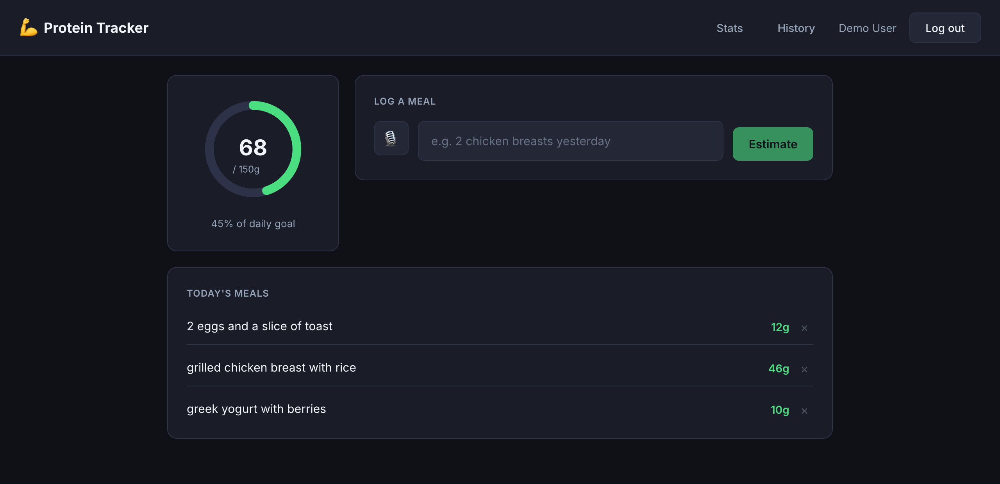

# 💪 Protein Tracker

Log meals in plain English (or by voice), get an AI-estimated protein count, and track progress toward a daily goal.

### 🔗 [**Live Demo → protein-tracker-lzkghp6vta-uc.a.run.app**](https://protein-tracker-lzkghp6vta-uc.a.run.app)



## Features

- **Email/password + Google Sign-In** authentication (JWT-based sessions)
- **Natural-language meal logging** — type or speak a description ("2 chicken breasts and rice"), get an AI-estimated protein count, then confirm or retry
- **Voice input** via ElevenLabs Speech-to-Text — transcribes into the text field, no auto-submit
- **Dashboard** with an animated protein ring, editable daily goal, and today's logged meals
- **History** view with per-entry delete
- **30-day stats** trend chart (custom SVG line chart)
- **Installable PWA** — add to home screen, offline app-shell caching
- Mobile-responsive throughout

## Tech Stack

**Frontend** — Angular 18 · RxJS 7.8 · TypeScript 5.4 · Angular Service Worker (PWA)

**Backend** — Spring Boot 3.3.4 (Java 21) · Spring Security + JWT (`jjwt`) · Spring Data MongoDB · [`langchain4j`](https://github.com/langchain4j/langchain4j) + Mistral AI (`mistral-small-latest`) for protein estimation · Google API Client (Google Sign-In verification) · ElevenLabs Speech-to-Text

**Infra & CI/CD** — Docker (multi-stage build, single image serves both frontend and backend) · MongoDB Atlas · Google Cloud Run · Terraform (Cloud Run, Artifact Registry, Secret Manager, IAM, Workload Identity Federation) · GitHub Actions

## Architecture

The Angular app is built as static assets and copied into the Spring Boot jar, so a single Docker image serves both the frontend and the `/api/**` backend from the same origin — no CORS needed in production. MongoDB Atlas is the persistence layer. The whole thing runs on Cloud Run, scaling to zero when idle.

## API Overview

| Method | Path | Description |
|---|---|---|
| POST | `/api/auth/register` | Create an account |
| POST | `/api/auth/login` | Log in, get a JWT |
| POST | `/api/auth/google` | Sign in with a Google ID token |
| GET | `/api/auth/me` | Current user |
| PATCH | `/api/auth/goal` | Update daily protein goal |
| GET | `/api/protein/today` | Today's logged entries + total |
| POST | `/api/protein/parse` | Estimate protein from a text description |
| POST | `/api/protein/confirm` | Save a confirmed entry |
| GET | `/api/protein/history` | Past days' logs |
| GET | `/api/protein/stats/monthly` | 30-day protein stats |
| DELETE | `/api/protein/entry/{date}/{entryId}` | Remove an entry |

## Testing & CI/CD

- **Backend**: JUnit tests against an embedded in-memory MongoDB (no external DB needed)
- **Frontend**: Karma/Jasmine unit tests
- **End-to-end (Playwright)**: a 19-test suite in [`frontend/e2e/`](frontend/e2e) (auth, goal-setting, meal-logging) that runs against the **live deployed site** on every push to `main` — not a staging mock. Run locally with `npm run e2e`.
- **End-to-end (Cypress)**: the same 19 tests duplicated in [`frontend/cypress/e2e/`](frontend/cypress/e2e) — a deliberate side-by-side port to demonstrate both major e2e frameworks. **Manual-only, not wired into CI.** Run locally with `npm run cy:run` (headless) or `npm run cy:open` (interactive).

Push to `main` triggers a 4-stage GitHub Actions pipeline: run backend tests → run frontend tests → build the image via Cloud Build and deploy to Cloud Run → run the full Playwright e2e suite against the freshly deployed URL. Deploys use Workload Identity Federation, so no long-lived GCP credentials are stored in CI. The Cypress suite is intentionally excluded from this pipeline. See [`docs/TESTING.md`](docs/TESTING.md) for exact setup and run steps for both suites.

## Running Locally

```bash
# 1. Start MongoDB
docker-compose up -d mongo

# 2. Configure environment
cp .env.example .env   # fill in MISTRAL_API_KEY at minimum

# 3. Backend (port 8080)
cd backend && mvn spring-boot:run

# 4. Frontend (port 4201)
cd frontend && ng serve --port 4201
```

For a quick backend run without Docker, use the `e2e` Spring profile (`SPRING_PROFILES_ACTIVE=e2e`), which spins up an embedded in-memory MongoDB automatically.

## License

MIT — see [LICENSE](LICENSE).

## Author

**Nile Cochen** — [github.com/19ndc2](https://github.com/19ndc2)
